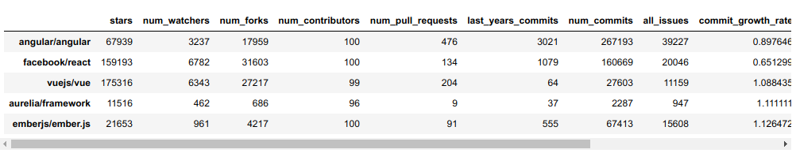

---
title:  'Erklärung der gewählten Parameter'
author:
- Jan Dietrich
keywords: [digitale, nachhaltigkeit]
description: |
    multiline
    description
...

# Hinweis

Alle Infos zu finden unter <https://github.com/CodeOneTwo/vorlesung-digitale-nachhaltigkeit>

# Repos

```
[
    "angular/angular",
    "facebook/react",
    "vuejs/vue",
    "aurelia/framework",
    "emberjs/ember.js"
]
```


# Output

[Jupyter Notebook](./u7.ipynb)



# Metriken

Die folgenden Metriken wurden gewählt, weil sie einen guten Indikator für die Grösse und Popularität der Projekte sind

Eher Popularität

- `stars`
- `num_watchers`
- `num_forks`

Eher Grösse

- `num_contributors`
- `num_pull_requests`
- `last_years_commits`
- `num_commits`
- `all_issues`

Weitere Metriken wurden berechnet um die Veränderung der Aktivität im Open Source Projekt zu zeigen:
Diese drei Metriken zeigen die Zu-, Abnahme der Aktivität als Faktor. Gemessen an der Aktivität in den letzten 3 Monaten und ins Verhältnis gesetzt zu den 9 Monaten zuvor.

- `commit_growth_rate`
- `open_issue_growth_rate`
- `closed_issue_growth_rate`

# Erkenntnisse

## Popularität

ReactJs ist am populärsten, hat am meisten Forks, Stars und Watches. Dicht gefolgt von VueJs.

## Grösse

Angular scheint am grössten zu sein. Das Projekt hat am meisten commits im letzten Jahr, die meisten offenen Issues und am meisten Pull Requests.

## Veränderunge Aktivität

ReactJs verzeichnet die grösste Abnahme an Aktivität in den letzten 3 Monaten
Starke Zunahme an Aktivität ist bei EmberJs zu erkennen


